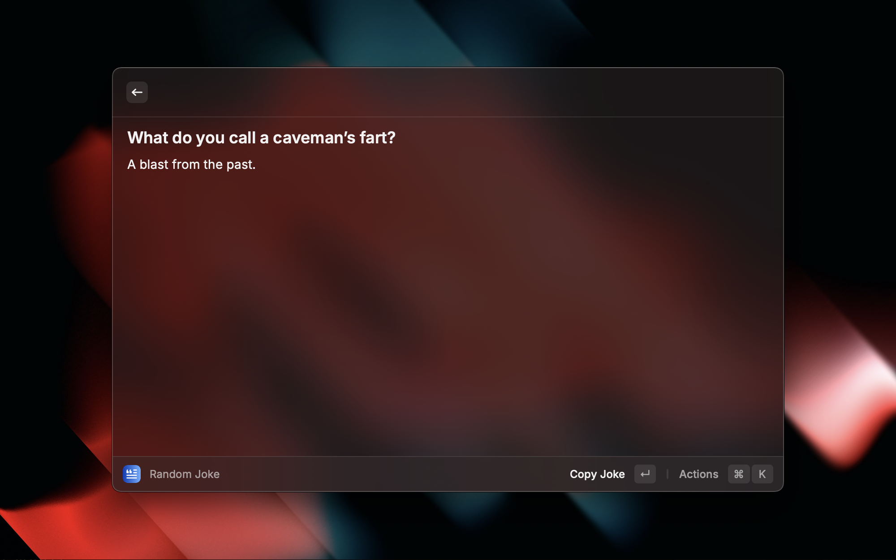

# Get Random Joke

"Get Random Joke" is a small Raycast extension that uses the JokeAPI to fetch jokes and deliver them to you. Made 100% in Windows.

## This is not in the store, how can i download it?

1. Download the .zip from [Releases](https://github.com/luiggircardoso/get-random-joke/releases/tag/Release) and extract
2. CD to the extracted folder and run `npm install`
3. Run `npm run dev`. In this step, the extension will be automatically installed and a Raycast Window will open.
4. To use it, just search for "Get Random Joke"
